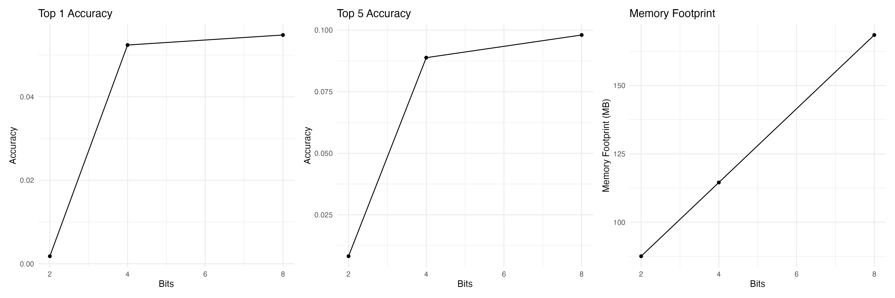

```
⠀⠀⠀⠀⠀⠀⢱⣆⠀⠀⠀⠀⠀⠀
⠀⠀⠀⠀⠀⠀⠈⣿⣷⡀⠀⠀⠀⠀
⠀⠀⠀⠀⠀⠀⢸⣿⣿⣷⣧⠀⠀⠀
⠀⠀⠀⠀⡀⢠⣿⡟⣿⣿⣿⡇⠀⠀        byte sized gains
⠀⠀⠀⠀⣳⣼⣿⡏⢸⣿⣿⣿⢀⠀  
⠀⠀⠀⣰⣿⣿⡿⠁⢸⣿⣿⡟⣼⡆        a performance analysis
⢰⢀⣾⣿⣿⠟⠀⠀⣾⢿⣿⣿⣿⣿        of quantized ml models
⢸⣿⣿⣿⡏⠀⠀⠀⠃⠸⣿⣿⣿⡿  
⢳⣿⣿⣿⠀⠀⠀⠀⠀⠀⢹⣿⡿⡁  
⠀⠹⣿⣿⡄⠀⠀⠀⠀⠀⢠⣿⡞⠁
⠀⠀⠈⠛⢿⣄⠀⠀⠀⣠⠞⠋⠀⠀
⠀⠀⠀⠀⠀⠀⠉⠀⠀⠀⠀⠀⠀⠀
```

In this project we're (among other things) quantizing the SmolLM-135M language model using `AutoGPTQ` with `int8`, `int4`, and `int2` configurations. The models were evaluated on the LAMBADA dataset, measuring top-1 and top-5 accuracy, inference speed, and memory footprint.




Results showed a trade-off between accuracy and model size, with the 4-bit model offering a good balance of performance and resource usage. The 8-bit model achieved the highest accuracy (5.48% top-1, 9.8% top-5) but required more memory, while the 2-bit model had the smallest footprint but significantly lower accuracy. Inference speeds were relatively consistent across configurations.
